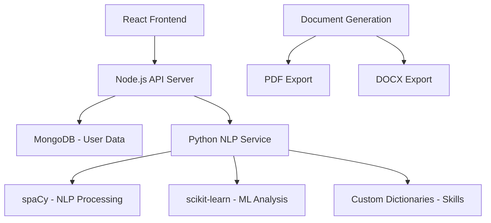

# CareerQuill - AI-Powered Resume Builder & ATS Optimizer

<div align="center">

**Build ATS-friendly resumes that actually get noticed - no design skills needed**

[Features](#-features) • [Tech Stack](#-tech-stack) • [Quick Start](#-quick-start) • [Project Structure](#-project-structure)

</div>

## 🎯 What is CareerQuill?

CareerQuill is a **full-stack web application** I built to solve a common job-seeker problem: creating resumes that pass through Applicant Tracking Systems (ATS) while maintaining professional design. It combines intelligent resume building with NLP-powered analysis to help users create job-winning resumes.

### 🚀 Key Capabilities

- **📝 Smart Resume Builder** - Create professional resumes from 6 customizable templates
- **🔍 ATS Score Analysis** - Get instant feedback on resume-job description compatibility
- **🎯 Keyword Optimization** - Discover missing skills and improve resume content
- **📄 Multi-Format Export** - Download as PDF or DOCX with perfect formatting
- **💾 Secure Dashboard** - Manage and version your resumes securely

## ✨ Features

### 🎨 Resume Building Experience

- **6 Professional Templates** - ATS-optimized designs for different industries
- **Guided Form Interface** - Step-by-step resume creation process
- **Real-time Preview** - See changes instantly as you build
- **Mobile-Responsive** - Works perfectly on all devices

### 🔍 ATS Intelligence

| Component                    | Description                             | Technology                          |
| ---------------------------- | --------------------------------------- | ----------------------------------- |
| **Resume Parser**            | Extract and analyze resume content      | spaCy, Custom NLP                   |
| **Job Description Analyzer** | Process and understand job requirements | scikit-learn, Text Processing       |
| **Similarity Scoring**       | Calculate resume-JD compatibility       | Cosine Similarity, Keyword Matching |
| **Keyword Suggestions**      | Recommend improvements                  | Skill Dictionaries, Industry Terms  |

### 👤 User Management

- **Secure Authentication** - JWT-based login system
- **Personal Dashboard** - Central hub for all your resumes
- **Resume Versioning** - Save and manage up to 5 resume versions
- **Data Protection** - Secure storage and privacy controls

## 🏗️ Architecture



## 🛠️ Tech Stack

### Frontend

- **React.js** - Modern UI framework with hooks
- **Tailwind CSS** - Utility-first styling
- **Vite** - Fast development and building
- **Context API** - State management

### Backend

- **Node.js** - Runtime environment
- **Express.js** - Web application framework
- **MongoDB** - NoSQL database
- **JWT** - Authentication tokens
- **Mongoose** - MongoDB object modeling

### AI/ML Service

- **Python** - Core processing language
- **FastAPI** - Modern Python web framework
- **spaCy** - Industrial-strength NLP
- **scikit-learn** - Machine learning algorithms
- **NLTK** - Text processing utilities

### Document Generation

- **pdf-lib** - PDF creation and manipulation
- **docx** - Word document processing
- **Custom Layout Engine** - Format preservation

## 🚀 Quick Start

### Prerequisites

- Node.js (v18 or higher)
- Python (v3.8 or higher)
- MongoDB (local or Atlas)

### Installation & Setup

#### 1. Clone the Repository

```bash
git clone https://github.com/your-username/careerquill.git
cd careerquill
```

#### 2. Backend Setup (Node.js)

```bash
cd backend
npm install

# Environment setup
cp .env.example .env
# Edit .env with your configurations
```

#### 3. Python NLP Service

```bash
cd python_nlp_service
python -m venv venv

# Windows
venv\Scripts\activate
# macOS/Linux
source venv/bin/activate

pip install -r requirements.txt
```

#### 4. Frontend Setup

```bash
cd frontend
npm install
```

#### 5. Run the Application

**Start all services in separate terminals:**

**Terminal 1 - Node.js Backend:**

```bash
cd backend
npm start
# Server running on http://localhost:5000
```

**Terminal 2 - Python NLP Service:**

```bash
cd python_nlp_service
source venv/bin/activate
python fastapi_app.py
# API docs at http://localhost:8000/docs
```

**Terminal 3 - Frontend:**

```bash
cd frontend
npm run dev
# App running on http://localhost:3000
```

Visit `http://localhost:3000` to start building your resume!

## ⚙️ Configuration

### Environment Variables

**Backend (.env):**

```env
# Server
PORT=5000
NODE_ENV=development

# Database
MONGODB_URI=mongodb://localhost:27017/careerquill

# JWT
JWT_SECRET=your_jwt_secret_key_here

# Python Service
PYTHON_SERVICE_URL=http://localhost:8000

# Optional: File Uploads
CLOUDINARY_CLOUD_NAME=your_cloud_name
CLOUDINARY_API_KEY=your_api_key
CLOUDINARY_API_SECRET=your_api_secret
```

**Python Service Configuration:**

- Skills dictionaries in `python_nlp_service/config/`
- NLP models automatically downloaded on first run
- Custom scoring thresholds adjustable in config

## 📖 Usage Guide

### Creating Your First Resume

1. **Sign Up & Login**

   - Create an account at `http://localhost:3000/register`
   - Login to access your personal dashboard

2. **Start Building**

   - Click "Create New Resume" from dashboard
   - Choose from 6 professional templates
   - Fill in the guided form with your information

3. **Real-time Preview**

   - Watch your resume take shape as you type
   - Switch between templates to find your perfect fit
   - All changes saved automatically

4. **Export Your Resume**
   - Download as PDF for online applications
   - Export as DOCX for easy editing
   - Both formats maintain perfect formatting

### Using ATS Analysis

1. **Upload for Analysis**

   - From dashboard, select a resume
   - Click "ATS Analysis"
   - Paste your target job description

2. **Review Results**

   - Get compatibility score (0-100)
   - See missing keywords and skills
   - Receive actionable improvement suggestions

3. **Optimize & Re-score**
   - Update your resume based on suggestions
   - Re-run analysis to track improvements
   - Compare different versions

### Managing Multiple Resumes

- **Version Control** - Save up to 5 versions per resume
- **Template Switching** - Apply different templates to same content
- **Bulk Operations** - Download multiple formats at once
- **Secure Storage** - Your data remains private and secure

## 📁 Project Structure

```
careerquill/
├── backend/                         # Node.js Express Server
│   ├── controllers/
│   │   ├── authController.js       # Authentication logic
│   │   └── resumeController.js     # Resume operations
│   ├── middleware/
│   │   ├── authMiddleware.js       # JWT verification
│   │   └── errorHandler.js         # Error handling
│   ├── models/
│   │   └── userModel.js            # User schema
│   ├── routes/
│   │   ├── authRoutes.js           # Auth endpoints
│   │   └── resumeRoutes.js         # Resume endpoints
│   ├── utils/
│   │   └── database.js             # DB connection
│   └── server.js                   # Main server file
├── frontend/                       # React Application
│   ├── src/
│   │   ├── components/
│   │   │   ├── common/
│   │   │   │   ├── Navbar.jsx
│   │   │   │   ├── Footer.jsx
│   │   │   │   └── UserNavbar.jsx
│   │   │   ├── resume/
│   │   │   │   ├── TemplateCard.jsx
│   │   │   │   └── ResumeForm.jsx
│   │   │   └── ats/
│   │   │       ├── ATSFilterer.jsx
│   │   │       └── ATSResult.jsx
│   │   ├── pages/
│   │   │   ├── Home.jsx            # Landing page
│   │   │   ├── Login.jsx           # Auth pages
│   │   │   ├── ResumeBuilder.jsx   # Main builder
│   │   │   ├── Templates.jsx       # Template selection
│   │   │   ├── UserDashboard.jsx   # User management
│   │   │   ├── ATSScoring.jsx      # ATS analysis
│   │   │   └── Profile.jsx         # User settings
│   │   ├── templates/              # Resume templates
│   │   │   ├── ResumeTemplate1.jsx
│   │   │   ├── ResumeTemplate2.jsx
│   │   │   └── ... (6 total)
│   │   ├── context/
│   │   │   ├── AuthContext.jsx     # Auth state
│   │   │   └── ResumeContext.jsx   # Resume state
│   │   └── api/
│   │       └── axios.js            # API client
│   └── public/
└── python_nlp_service/             # AI Processing Service
    ├── modules/
    │   ├── ats_scorer.py           # Main scoring logic
    │   ├── resume_parser.py        # Resume parsing
    │   ├── jd_processor.py         # Job description analysis
    │   ├── similarity_scorer.py    # Compatibility scoring
    │   └── skills_standardizer.py  # Skill normalization
    ├── config/                     # Dictionaries & configs
    │   ├── skills_map_final.json
    │   ├── certifications.json
    │   ├── domains.json
    │   └── soft_skills.json
    └── fastapi_app.py              # FastAPI application
```

## 🔌 API Endpoints

### Node.js Backend (Port 5000)

- `POST /api/auth/register` - User registration
- `POST /api/auth/login` - User login
- `GET /api/auth/profile` - Get user profile
- `GET /api/resumes` - Get user's resumes
- `POST /api/resumes` - Create new resume
- `PUT /api/resumes/:id` - Update resume
- `DELETE /api/resumes/:id` - Delete resume

### Python NLP Service (Port 8000)

- `POST /api/ats/analyze` - Analyze resume against job description
- `POST /api/parse/resume` - Parse resume content
- `GET /api/health` - Service health check

## 🛠️ Development

### Running in Development Mode

**Start all services simultaneously:**

```bash
# Terminal 1 - Backend API
cd backend
npm run dev

# Terminal 2 - NLP Service
cd python_nlp_service
source venv/bin/activate
uvicorn fastapi_app:app --reload --port 8000

# Terminal 3 - Frontend
cd frontend
npm run dev
```

### Testing the ATS System

```bash
cd python_nlp_service
python -m pytest tests/ -v
```

## 🆘 Troubleshooting

### Common Issues

1. **Port Conflicts**

   - Backend: Port 5000
   - Python Service: Port 8000
   - Frontend: Port 3000 (Vite default)

2. **Python Dependencies**

   - Ensure virtual environment is activated
   - Run `pip install -r requirements.txt` if errors occur

3. **MongoDB Connection**

   - Verify MongoDB is running locally
   - Or update MONGODB_URI for Atlas connection

4. **NLP Models**
   - spaCy models download automatically on first run
   - Internet connection required for initial setup

### Performance Notes

- ATS analysis typically completes in 5-7 seconds
- Document generation is optimized for speed
- Large resumes may take additional processing time

## 🎯 What I Learned

Building CareerQuill taught me valuable lessons in:

- **Full-Stack Integration** - Connecting React, Node.js, and Python services
- **NLP Practical Application** - Implementing spaCy and scikit-learn for real-world use cases
- **Document Generation** - Creating professional PDF/DOCX exports programmatically
- **Authentication Systems** - Secure JWT implementation and user management
- **Performance Optimization** - Balancing feature richness with speed

## 🔮 Future Enhancements

- [ ] **Cover Letter Generator** - AI-powered cover letters matching resumes
- [ ] **Job Board Integration** - Direct application to job postings
- [ ] **Resume Analytics** - Track application success rates
- [ ] **Multi-language Support** - Resumes in different languages
- [ ] **Advanced ATS Simulation** - Industry-specific ATS testing

---

<div align="center">

**Built with ❤️ as a personal project to help job seekers worldwide**

_If this project helps you in your job search, consider giving it a star!_

</div>
